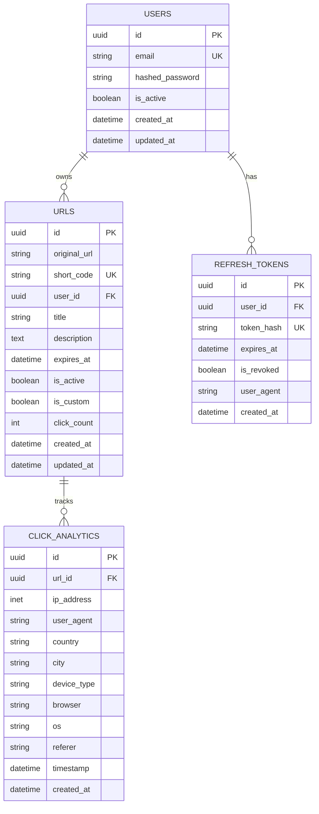

# 🔗 KLYP — Enterprise URL Shortener & Link Intelligence Platform

[](https://www.python.org/)
[](https://fastapi.tiangolo.com/)
[](https://www.postgresql.org/)
[](https://redis.io/)
[](https://www.docker.com/)
[](#-testing--quality-assurance)
[](https://github.com/astral-sh/ruff)
[](LICENSE)

**KLYP** is a high-throughput, enterprise-ready URL shortening microservice and link analytics platform built with **FastAPI**, **SQLAlchemy (Async)**, **PostgreSQL 16**, and **Redis 7**. 

Engineered with a **cache-first architecture**, non-blocking background telemetry, sliding-window rate limiting, JWT token rotation, and a modern single-page dashboard.

---

## 📑 Table of Contents

- [Architectural Overview](#-architectural-overview)
- [Key Features](#-key-features)
- [Interactive Frontend Showcase](#-interactive-frontend-showcase)
- [Tech Stack](#-tech-stack)
- [System Architecture](#-system-architecture)
- [Database Schema (ERD)](#-database-schema-erd)
- [API Reference](#-api-reference)
- [Getting Started](#-getting-started)
  - [Option 1: Docker Compose (Recommended)](#option-1-docker-compose-recommended)
  - [Option 2: Local Standalone Setup](#option-2-local-standalone-setup)
- [Environment Configuration](#-environment-configuration)
- [Testing & Quality Assurance](#-testing--quality-assurance)
- [CI/CD Pipeline](#-cicd-pipeline)
- [Interview & Architectural Deep-Dive (STAR)](#-interview--architectural-deep-dive-star)

---

## 🏛 Architectural Overview

```
                                  ┌──────────────────────────┐
                                  │      Client Request      │
                                  │  (Web UI / Mobile / API) │
                                  └─────────────┬────────────┘
                                                │
                                                ▼
                                  ┌──────────────────────────┐
                                  │  FastAPI ASGI Pipeline   │
                                  └─────────────┬────────────┘
                                                │
                       ┌────────────────────────┴────────────────────────┐
                       ▼                                                 ▼
        ┌─────────────────────────────┐                   ┌─────────────────────────────┐
        │      LoggingMiddleware      │                   │     RateLimitMiddleware     │
        │  • X-Request-ID Tracking    │                   │  • Redis Sliding Window     │
        │  • High-Res Latency Metric  │                   │  • Tiered (50 Anon/500 Auth)│
        └──────────────┬──────────────┘                   └──────────────┬──────────────┘
                       └────────────────────────┬────────────────────────┘
                                                ▼
                                  ┌──────────────────────────┐
                                  │     API Routing Layer    │
                                  │  • /api/v1/auth          │
                                  │  • /api/v1/urls          │
                                  │  • /api/v1/analytics     │
                                  │  • /api/v1/my-urls       │
                                  │  • /{short_code} (302)   │
                                  └─────────────┬────────────┘
                                                │
                                                ▼
                                  ┌──────────────────────────┐
                                  │   URL & Domain Service   │
                                  └─────────────┬────────────┘
                                                │
                       ┌────────────────────────┴────────────────────────┐
                       ▼                                                 ▼
        ┌─────────────────────────────┐                   ┌─────────────────────────────┐
        │     Redis Cache-Aside       │                   │    PostgreSQL Repository    │
        │  • 30-min (1800s) TTL       │◄── (Cache Miss) ──│  • Async SQLAlchemy 2.0     │
        │  • Sub-millisecond Lookup   │                   │  • Connection Pooling       │
        │  • Write-Invalidation       │                   │  • Composite Indexes        │
        └─────────────────────────────┘                   └──────────────┬──────────────┘
                                                                         │
                                                ┌────────────────────────┘
                                                ▼
                                  ┌──────────────────────────┐
                                  │ FastAPI BackgroundTasks  │
                                  │  • RFC1918 GeoIP Lookup  │
                                  │  • UA Browser/OS Parser  │
                                  │  • Async Click Counter   │
                                  └──────────────────────────┘
```

---

## ✨ Key Features

### 1. ⚡ High-Throughput Base62 Shortening
- Converts database sequences or cryptographically secure random integers into 7-character Base62 slugs (`[0-9a-zA-Z]`), yielding **$62^7 \approx 3.52\text{ Trillion}$ unique combinations**.
- Handles custom vanity slugs with reserved namespace checks (`/health`, `/docs`, `/api`, `/admin`) and collision mitigation retries.

### 2. 🚀 Sub-Millisecond Cache-Aside Redirection
- High-concurrency **HTTP 302 Found** redirects.
- **Cache-Aside Pattern**: Resolves slugs from Redis in $<1\text{ms}$. On cache miss, queries PostgreSQL and lazily populates Redis with a configurable 30-minute ($1800\text{s}$) TTL.
- Explicit cache eviction on URL deletion or expiry modification to eliminate stale reads.

### 3. 📊 Non-Blocking Click Telemetry & Analytics
- Redirection responses return immediately to the client without waiting for analytics persistence.
- Asynchronous `BackgroundTasks` extract client IP (supporting `X-Forwarded-For` / `X-Real-IP`), resolve geographical location with private network (RFC 1918) filtering, and parse browser, OS, and device family.
- Aggregates daily time-series click history, country distributions, browser distributions, and device breakdowns.

### 4. 🔐 Robust JWT Authentication & Token Rotation
- Stateless JWT Access Tokens ($15\text{-minute}$ lifetime) paired with single-use Refresh Tokens ($7\text{-day}$ lifetime).
- **Refresh Token Rotation (RTR)**: Using a refresh token issues a brand-new token pair and immediately invalidates the consumed token, preventing token theft and replay attacks.
- Passwords hashed using industry-standard **Argon2id / Bcrypt**.

### 5. 🛡️ Tiered Sliding-Window Rate Limiting
- Redis atomic pipeline (`INCR` + `EXPIRE`) enforcing sliding-window rate limits.
- **Tiered Quotas**: $50\text{ req/hr}$ for anonymous clients (by IP) vs $500\text{ req/hr}$ for authenticated users (by JWT `sub`).
- Injects standard RFC rate limit headers (`X-RateLimit-Limit`, `X-RateLimit-Remaining`, `X-RateLimit-Reset`, `Retry-After`).
- Built with **fail-open fault tolerance** to ensure service availability if Redis is unreachable.

### 6. 📱 Interactive Single-Page Web Frontend (SPA)
- Modern Vanilla HTML5/CSS/JavaScript single-page application served at `http://localhost:8000/`.
- Dark and Light mode theme toggle with persistent preferences.
- Dynamic client-side **QR Code Generator** modal.
- Authenticated **"My Links"** dashboard with live search filtering, click counters, and soft-deletion.
- Real-time **Analytics Modal** with custom interactive SVG line charts.

---

## 🎨 Interactive Frontend Showcase

| Feature | Description |
|---|---|
| **Quick Shortener** | Instant URL shortening with custom alias input, auto-expiry presets (24h, 7d, 30d), and tag annotations. |
| **Result Card** | Instant short link display with 1-click clipboard copy, QR code generation canvas, and test redirect buttons. |
| **Auth Portal** | Modal-based login and registration with validation and JWT token persistence. |
| **My Links Dashboard** | Searchable data table listing active links, click metrics, creation dates, and management actions. |
| **Analytics Explorer** | Detailed modal showing total clicks, SVG daily trend chart, and country/browser distribution progress bars. |
| **System Status Pill** | Live status indicator polling `/api/v1/health` for real-time uptime monitoring. |

---

## 🛠️ Tech Stack

| Domain | Technology | Version / Specification |
|---|---|---|
| **Language** | Python | `3.11`, `3.12` |
| **Web Framework** | FastAPI | `0.111+` (ASGI, Starlette) |
| **Database ORM** | SQLAlchemy | `2.0+` (Async Engine, Mapped Columns) |
| **Database** | PostgreSQL | `16.0-alpine` |
| **In-Memory Cache** | Redis | `7.0-alpine` (LRU eviction) |
| **DB Migrations** | Alembic | `1.13+` (Async environment) |
| **Security & Auth** | python-jose, passlib | JWT (HS256), Argon2 / Bcrypt |
| **Containerization** | Docker, Compose | Multi-stage build (`python:3.12-slim`) |
| **Code Quality** | Ruff, Mypy | AST Linting, Strict Static Typing |
| **Testing** | Pytest, AnyIO, HTTPX | 102 Tests (Unit + Integration) |

---

## 🗄 Database Schema (ERD)



---

## 🌐 API Reference

### 1. Authentication Endpoints

| Method | Endpoint | Description | Auth Required |
|---|---|---|:---:|
| `POST` | `/api/v1/auth/signup` | Register a new user account & return JWT tokens | No |
| `POST` | `/api/v1/auth/login` | Authenticate with email/password & return tokens | No |
| `POST` | `/api/v1/auth/refresh` | Exchange a refresh token for a new access token (RTR) | No |
| `POST` | `/api/v1/auth/logout` | Revoke active refresh token | No |
| `GET` | `/api/v1/auth/me` | Fetch profile details of current user | **Bearer** |

### 2. URL Shortening & Redirection

| Method | Endpoint | Description | Auth Required |
|---|---|---|:---:|
| `POST` | `/api/v1/urls` | Shorten URL (optional custom alias & expiration) | Optional |
| `GET` | `/api/v1/urls/{code}` | Retrieve short URL metadata and details | No |
| `GET` | `/api/v1/urls/{code}/redirect` | HTTP 302 redirection to original target URL | No |
| `GET` | `/{code}` | Top-level HTTP 302 root redirect | No |

### 3. Analytics & Dashboard

| Method | Endpoint | Description | Auth Required |
|---|---|---|:---:|
| `GET` | `/api/v1/analytics/{code}` | Time-series click metrics & platform distribution | Owner / Public |
| `GET` | `/api/v1/my-urls` | Paginated listing of user's shortened links | **Bearer** |
| `PATCH` | `/api/v1/my-urls/{code}` | Update short URL expiry timestamp | **Bearer** |
| `DELETE` | `/api/v1/my-urls/{code}` | Deactivate and soft-delete short URL | **Bearer** |

### 4. Health & Documentation

| Method | Endpoint | Description |
|---|---|---|
| `GET` | `/api/v1/health` | Service liveness, PostgreSQL & Redis health probes |
| `GET` | `/docs` | Interactive Swagger UI API Explorer |
| `GET` | `/redoc` | ReDoc API Documentation |

---

## 🚀 Getting Started

### Option 1: Docker Compose (Recommended)

Run the entire multi-container production stack with a single command:

```bash
# 1. Clone repository
git clone https://github.com/your-username/url-shortener.git
cd url-shortener

# 2. Configure environment
cp .env.example .env

# 3. Build and launch containers
docker compose up --build -d
```

- **Frontend App**: [http://localhost:8000/](http://localhost:8000/)
- **Swagger Docs**: [http://localhost:8000/docs](http://localhost:8000/docs)
- **Health Check**: [http://localhost:8000/api/v1/health](http://localhost:8000/api/v1/health)

---

### Option 2: Local Standalone Setup

```bash
# 1. Create and activate Python virtual environment
python -m venv .venv
source .venv/bin/activate       # On Linux/macOS
# .venv\Scripts\activate        # On Windows

# 2. Install dependencies
pip install -r requirements.txt

# 3. Configure environment
cp .env.example .env

# 4. Start local development server
python -m uvicorn main:app --reload --host 127.0.0.1 --port 8000
```

---

## ⚙️ Environment Configuration

| Variable | Default | Description |
|---|---|---|
| `APP_NAME` | `"URL Shortener"` | Application title |
| `APP_ENV` | `"development"` | Environment (`development` / `production`) |
| `SECRET_KEY` | `dev-secret-key-32-chars...` | Cryptographic secret for signing JWTs |
| `DATABASE_URL` | `postgresql+asyncpg://...` | Asynchronous SQLAlchemy database URL |
| `REDIS_URL` | `redis://localhost:6379/0` | Redis connection URL |
| `CACHE_TTL_SECONDS` | `1800` | Redis short URL cache expiration (30 mins) |
| `RATE_LIMIT_ANON_REQUESTS` | `50` | Max requests per hour for anonymous IPs |
| `RATE_LIMIT_AUTH_REQUESTS` | `500` | Max requests per hour for authenticated JWTs |
| `SHORT_CODE_LENGTH` | `7` | Length of autogenerated Base62 short codes |

---

## 🧪 Testing & Quality Assurance

The project includes an end-to-end automated test suite covering all units, repositories, services, middlewares, and HTTP integration flows.

```bash
# Run the entire test suite (102 tests)
pytest

# Run with test coverage report
pytest --cov=app --cov-report=term-missing

# Run linter checks
ruff check .

# Run static type checks
python -m mypy app/
```

### Test Suite Summary:
```text
tests/integration/test_analytics_flow.py .... [  4%]
tests/integration/test_auth_flow.py ......... [ 11%]
tests/integration/test_dashboard_flow.py .... [ 15%]
tests/integration/test_health.py ............ [ 16%]
tests/integration/test_rate_limiting_flow.py  [ 18%]
tests/integration/test_redirect_flow.py ..... [ 21%]
tests/integration/test_urls.py .............. [ 29%]
tests/unit/test_analytics.py ................ [ 41%]
tests/unit/test_cache.py .................... [ 48%]
tests/unit/test_dashboard.py ................ [ 54%]
tests/unit/test_openapi.py .................. [ 56%]
tests/unit/test_rate_limit.py ............... [ 64%]
tests/unit/test_redirect.py ................. [ 74%]
tests/unit/test_shortcode.py ................ [ 93%]
tests/unit/test_url_service.py .............. [100%]

====================== 102 passed in 4.69s =======================
```

---

## 🔄 CI/CD Pipeline

The repository includes a production **GitHub Actions** workflow (`.github/workflows/ci.yml`):

1. **Lint & Format**: Enforces PEP8, import sorting, and bugbear rules via **Ruff**.
2. **Type Checking**: Runs **Mypy** static analysis across all schemas and services.
3. **Automated Testing**: Runs pytest matrix across Python `3.11` and `3.12` with XML code coverage exports.
4. **Multi-Arch Docker Build**: Cross-compiles images for `linux/amd64` and `linux/arm64` and publishes tagged releases to **GitHub Container Registry (GHCR)**.


---


